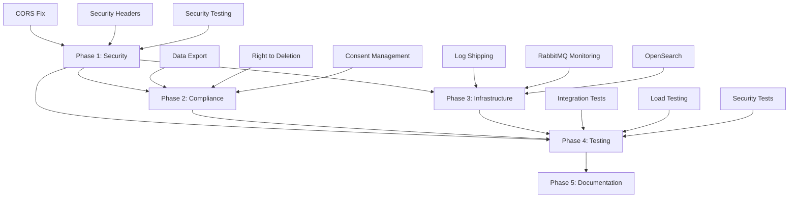

# JobSwipe Production Readiness Implementation Plan

## Executive Summary

This document provides a comprehensive roadmap for achieving production-ready status for the JobSwipe job search and automation platform. The plan prioritizes work based on critical path dependencies: **Security → Compliance → Infrastructure → Testing**.

## Current State Assessment

### What Already Exists

#### Security (70% Complete)
- [x] Security headers middleware ([`backend/api/middleware/security_headers.py`](backend/api/middleware/security_headers.py:1))
  - CSP, HSTS, X-Frame-Options, X-XSS-Protection, X-Content-Type-Options, Referrer-Policy, Permissions-Policy
- [x] API key authentication middleware ([`backend/api/middleware/api_key_auth.py`](backend/api/middleware/api_key_auth.py:1))
- [x] Input sanitization middleware ([`backend/api/middleware/input_sanitization.py`](backend/api/middleware/input_sanitization.py:1))
- [x] Output encoding middleware ([`backend/api/middleware/output_encoding.py`](backend/api/middleware/output_encoding.py:1))
- [x] File validation middleware ([`backend/api/middleware/file_validation.py`](backend/api/middleware/file_validation.py:1))
- [x] Error handling middleware ([`backend/api/middleware/error_handling.py`](backend/api/middleware/error_handling.py:1))
- [x] Request deduplication middleware ([`backend/api/middleware/request_deduplication.py`](backend/api/middleware/request_deduplication.py:1))
- [x] Compression middleware ([`backend/api/middleware/compression.py`](backend/api/middleware/compression.py:1))
- [x] PII encryption utilities ([`backend/encryption.py`](backend/encryption.py:1))
- [x] Rate limiting with slowapi ([`backend/api/main.py`](backend/api/main.py:199))
- [x] JWT authentication with refresh tokens ([`backend/api/routers/auth.py`](backend/api/routers/auth.py:1))
- [x] MFA support ([`backend/services/mfa_service.py`](backend/services/mfa_service.py:1))
- [x] Failed login attempt tracking ([`backend/db/models.py`](backend/db/models.py:98))
- [x] Password hashing with Argon2 ([`backend/api/routers/auth.py`](backend/api/routers/auth.py:44))

#### Health Checks (80% Complete)
- [x] Basic health endpoint ([`/health`](backend/api/main.py:342))
- [x] Readiness check with DB/Redis ([`/ready`](backend/api/main.py:352))
- [x] Worker health check ([`/health/worker`](backend/api/main.py:403))
- [x] Prometheus metrics endpoint ([`/metrics`](backend/api/main.py:395))
- [x] Database health check in readiness probe
- [x] Redis health check in readiness probe

#### API Documentation (60% Complete)
- [x] API documentation markdown ([`backend/docs/api_documentation.md`](backend/docs/api_documentation.md:1))
- [x] Security headers documentation ([`backend/docs/security_headers.md`](backend/docs/security_headers.md:1))
- [x] Deployment procedures ([`backend/docs/deployment_procedures.md`](backend/docs/deployment_procedures.md:1))
- [x] OpenAPI/Swagger auto-generated (via FastAPI)
- [ ] Interactive API explorer customization
- [ ] API versioning strategy documentation

#### Testing (50% Complete)
- [x] Unit tests for security headers ([`backend/tests/test_security_headers.py`](backend/tests/test_security_headers.py:1))
- [x] Integration tests for auth ([`backend/tests/test_auth.py`](backend/tests/test_auth.py:1))
- [x] E2E user flow tests ([`backend/tests/test_e2e_user_flow.py`](backend/tests/test_e2e_user_flow.py:1))
- [x] Concurrency tests ([`backend/tests/test_concurrency.py`](backend/tests/test_concurrency.py:1))
- [x] Performance tests ([`backend/tests/test_performance_db_connection_pool.py`](backend/tests/test_performance_db_connection_pool.py:1))
- [ ] Load testing framework
- [ ] Chaos engineering tests
- [ ] Contract testing

#### Infrastructure (70% Complete)
- [x] Docker Compose for local dev ([`docker-compose.yml`](docker-compose.yml:1))
- [x] Docker Compose for production ([`docker-compose.production.yml`](docker-compose.production.yml:1))
- [x] Fly.io deployment config ([`backend/fly.toml`](backend/fly.toml:1))
- [x] Multi-process setup (API + Worker)
- [x] Auto-scaling configuration
- [x] Health check endpoints configured
- [ ] Log shipping infrastructure
- [ ] Centralized monitoring stack

#### Backup & Disaster Recovery (80% Complete)
- [x] Backup script with encryption ([`backup/backup_postgres.sh`](backup/backup_postgres.sh:1))
- [x] Restore script ([`backup/restore_postgres.sh`](backup/restore_postgres.sh:1))
- [x] Disaster recovery runbook ([`backup/DISASTER_RECOVERY_RUNBOOK.md`](backup/DISASTER_RECOVERY_RUNBOOK.md:1))
- [x] S3 backup storage
- [x] Automated cleanup of old backups
- [ ] Point-in-time recovery
- [ ] Cross-region backup replication

#### Architecture Decision Records (30% Complete)
- [x] ADR-001: FastAPI choice ([`backend/docs/adr/ADR-001-choose-fastapi.md`](backend/docs/adr/ADR-001-choose-fastapi.md:1))
- [x] ADR-002: PostgreSQL choice ([`backend/docs/adr/ADR-002-choose-postgresql.md`](backend/docs/adr/ADR-002-choose-postgresql.md:1))
- [x] ADR-003: JWT authentication ([`backend/docs/adr/ADR-003-jwt-authentication.md`](backend/docs/adr/ADR-003-jwt-authentication.md:1))
- [ ] ADR-004: Rate limiting strategy
- [ ] ADR-005: GDPR compliance approach
- [ ] ADR-006: Data retention policy
- [ ] ADR-007: Monitoring and observability

### What's Missing (Gaps)

#### Critical Security Gaps
1. **CORS Configuration Review** - Current CORS in [`backend/config.py`](backend/config.py:91) allows localhost in production
2. **Security Header Testing** - No automated CSP violation reporting
3. **Penetration Testing** - No documented penetration test results
4. **Dependency Scanning** - No automated vulnerability scanning in CI/CD
5. **Secrets Rotation** - Documented but not automated ([`SECURITY_CREDENTIAL_ROTATION.md`](SECURITY_CREDENTIAL_ROTATION.md:1))

#### Compliance Gaps (GDPR/CCPA)
1. **Data Export Endpoint** - No user data export functionality
2. **Right to Deletion** - No account deletion/data erasure endpoint
3. **Consent Management** - No tracking of user consent for data processing
4. **Privacy Policy Integration** - No API endpoints for privacy-related operations
5. **Data Processing Agreements** - No documentation of data processors
6. **Breach Notification Process** - No documented incident response for data breaches

#### Infrastructure Gaps
1. **Log Shipping** - No centralized log aggregation (OpenSearch/ELK)
2. **RabbitMQ Health Checks** - Basic health check exists but no detailed queue monitoring
3. **OpenSearch Integration** - No search infrastructure configured
4. **CDN Configuration** - No CDN for static assets
5. **WAF Configuration** - No Web Application Firewall rules

#### Testing Gaps
1. **Integration Test Coverage** - Missing tests for several routers
2. **Load Testing** - No k6 or Locust configuration
3. **Security Testing** - No OWASP ZAP or similar automated security testing
4. **Contract Tests** - No Pact or similar contract testing
5. **Chaos Engineering** - No failure injection testing

---

## Implementation Roadmap

### Phase 1: Security Hardening (Week 1-2)
**Priority: CRITICAL**

#### 1.1 CORS Configuration Fix
- **File**: [`backend/config.py`](backend/config.py:91)
- **Task**: Implement environment-specific CORS origins
- **Mode**: Code
- **Details**:
  - Remove localhost origins from production
  - Add strict origin validation
  - Implement origin whitelist from environment variable

#### 1.2 Security Headers Enhancement
- **File**: [`backend/api/middleware/security_headers.py`](backend/api/middleware/security_headers.py:1)
- **Task**: Add CSP reporting and nonce support
- **Mode**: Code
- **Details**:
  - Add CSP report-uri directive
  - Implement nonce generation for inline scripts
  - Add Report-To header for violation reporting

#### 1.3 Security Testing Automation
- **File**: `.github/workflows/security.yml` (new)
- **Task**: Create GitHub Actions workflow for security scanning
- **Mode**: Code
- **Details**:
  - Integrate OWASP Dependency Check
  - Add Bandit for Python security linting
  - Add Safety for dependency vulnerability scanning
  - Run on every PR

#### 1.4 Secrets Management Audit
- **File**: [`backend/vault_secrets.py`](backend/vault_secrets.py:1)
- **Task**: Implement automated secrets rotation
- **Mode**: Code
- **Details**:
  - Add secrets rotation scheduler
  - Implement graceful key rotation for encryption
  - Add monitoring for secrets expiry

### Phase 2: GDPR/CCPA Compliance (Week 2-3)
**Priority: CRITICAL**
**Dependencies**: Phase 1

#### 2.1 Data Export Functionality
- **Files**: 
  - [`backend/api/routers/gdpr.py`](backend/api/routers/gdpr.py:1) (new)
  - [`backend/services/data_export_service.py`](backend/services/data_export_service.py:1) (new)
- **Task**: Implement user data export endpoint
- **Mode**: Code
- **Details**:
  - Create `/api/v1/user/data-export` endpoint
  - Export all user data in JSON format
  - Include: profile, applications, interactions, notifications
  - Async processing with email notification
  - Data retention: 7 days for export files

#### 2.2 Right to Deletion
- **Files**:
  - [`backend/api/routers/gdpr.py`](backend/api/routers/gdpr.py:1) (update)
  - [`backend/services/data_deletion_service.py`](backend/services/data_deletion_service.py:1) (new)
- **Task**: Implement account deletion and data erasure
- **Mode**: Code
- **Details**:
  - Create `/api/v1/user/delete-account` endpoint
  - Soft delete with 30-day grace period
  - Permanent deletion after grace period
  - Anonymize application audit logs
  - Cancel pending application tasks

#### 2.3 Consent Management
- **Files**:
  - [`backend/db/models.py`](backend/db/models.py:1) (update)
  - [`backend/api/routers/consent.py`](backend/api/routers/consent.py:1) (new)
- **Task**: Add consent tracking
- **Mode**: Code
- **Details**:
  - Add `UserConsent` model with fields:
    - consent_type (marketing, analytics, data_processing)
    - granted_at, revoked_at
    - ip_address, user_agent
  - Create consent management endpoints
  - Require consent for data processing operations

#### 2.4 Privacy Policy API
- **File**: [`backend/api/routers/privacy.py`](backend/api/routers/privacy.py:1) (new)
- **Task**: Create privacy-related endpoints
- **Mode**: Code
- **Details**:
  - `/api/v1/privacy/policy` - Get current privacy policy
  - `/api/v1/privacy/data-processors` - List data processors
  - `/api/v1/privacy/retention-policy` - Data retention info

#### 2.5 GDPR Compliance ADR
- **File**: [`backend/docs/adr/ADR-005-gdpr-compliance.md`](backend/docs/adr/ADR-005-gdpr-compliance.md) (new)
- **Task**: Document GDPR compliance approach
- **Mode**: Architect

### Phase 3: Infrastructure & Observability (Week 3-4)
**Priority: HIGH**
**Dependencies**: Phase 1

#### 3.1 Log Shipping Infrastructure
- **Files**:
  - `docker-compose.logging.yml` (new)
  - [`backend/logging_config.py`](backend/logging_config.py:1) (update)
- **Task**: Implement centralized log aggregation
- **Mode**: Code
- **Details**:
  - Deploy OpenSearch + Fluentd/Fluent Bit
  - Configure structured JSON logging
  - Add correlation ID tracking
  - Create log retention policies (90 days)

#### 3.2 RabbitMQ Monitoring
- **Files**:
  - [`backend/api/main.py`](backend/api/main.py:342) (update)
  - [`backend/services/queue_monitoring.py`](backend/services/queue_monitoring.py:1) (new)
- **Task**: Enhanced RabbitMQ health checks and metrics
- **Mode**: Code
- **Details**:
  - Add queue depth monitoring
  - Add consumer lag metrics
  - Add dead letter queue monitoring
  - Create alerts for queue buildup

#### 3.3 OpenSearch Integration
- **Files**:
  - `docker-compose.search.yml` (new)
  - [`backend/services/search_service.py`](backend/services/search_service.py:1) (new)
- **Task**: Implement OpenSearch for job indexing
- **Mode**: Code
- **Details**:
  - Deploy OpenSearch cluster
  - Create job index mapping
  - Implement search service
  - Add full-text search endpoints

#### 3.4 Monitoring Dashboard
- **Files**:
  - `monitoring/grafana/dashboards/` (new)
- **Task**: Create Grafana dashboards
- **Mode**: Code
- **Details**:
  - API performance dashboard
  - Error rate dashboard
  - Infrastructure health dashboard
  - Business metrics dashboard

#### 3.5 Infrastructure ADR
- **File**: [`backend/docs/adr/ADR-007-monitoring-observability.md`](backend/docs/adr/ADR-007-monitoring-observability.md) (new)
- **Task**: Document monitoring architecture
- **Mode**: Architect

### Phase 4: Testing & Quality Assurance (Week 4-5)
**Priority: HIGH**
**Dependencies**: Phase 1, Phase 2

#### 4.1 Integration Test Expansion
- **Files**:
  - [`backend/tests/integration/`](backend/tests/integration/) (new directory)
- **Task**: Expand integration test coverage
- **Mode**: Code
- **Details**:
  - Test all API routers
  - Test database transactions
  - Test external service integrations
  - Target: 80% coverage

#### 4.2 Load Testing Framework
- **Files**:
  - `tests/load/k6/` (new)
- **Task**: Implement load testing with k6
- **Mode**: Code
- **Details**:
  - Create load test scenarios
  - Test authentication endpoints
  - Test job matching endpoints
  - Test concurrent user simulation

#### 4.3 Security Testing
- **Files**:
  - `.zap/rules.tsv` (update)
  - `tests/security/` (new)
- **Task**: Automated security testing
- **Mode**: Code
- **Details**:
  - OWASP ZAP baseline scan
  - API fuzzing tests
  - Authentication bypass tests
  - Rate limiting tests

#### 4.4 Contract Testing
- **Files**:
  - `tests/contracts/` (new)
- **Task**: Implement Pact contract testing
- **Mode**: Code
- **Details**:
  - Define consumer contracts
  - Verify provider contracts
  - Integrate into CI/CD

#### 4.5 Testing ADR
- **File**: [`backend/docs/adr/ADR-008-testing-strategy.md`](backend/docs/adr/ADR-008-testing-strategy.md) (new)
- **Task**: Document testing approach
- **Mode**: Architect

### Phase 5: Documentation & Operational Readiness (Week 5-6)
**Priority: MEDIUM**
**Dependencies**: Phase 1-4

#### 5.1 API Documentation Enhancement
- **File**: [`backend/docs/api_documentation.md`](backend/docs/api_documentation.md:1) (update)
- **Task**: Complete API documentation
- **Mode**: Architect
- **Details**:
  - Document all endpoints
  - Add request/response examples
  - Document error codes
  - Add rate limit information

#### 5.2 Operational Runbooks
- **Files**:
  - [`backend/docs/runbooks/`](backend/docs/runbooks/) (new)
- **Task**: Create operational procedures
- **Mode**: Architect
- **Details**:
  - Incident response runbook
  - Deployment runbook
  - Rollback procedures
  - Database migration procedures

#### 5.3 Onboarding Documentation
- **File**: [`backend/docs/onboarding.md`](backend/docs/onboarding.md) (new)
- **Task**: Developer onboarding guide
- **Mode**: Architect
- **Details**:
  - Environment setup
  - Development workflow
  - Testing guidelines
  - Deployment process

#### 5.4 Architecture Decision Records
- **Files**:
  - [`backend/docs/adr/`](backend/docs/adr/) (update)
- **Task**: Complete ADR documentation
- **Mode**: Architect
- **Details**:
  - ADR-004: Rate limiting strategy
  - ADR-006: Data retention policy
  - ADR-009: Backup and recovery strategy

---

## Workstream Dependencies

---

## Specialized Mode Assignments

| Component | Mode | Rationale |
|-----------|------|-----------|
| Security middleware fixes | Code | Direct code changes required |
| GDPR endpoints/services | Code | New API endpoints and services |
| Log shipping infrastructure | Code | Docker/config changes |
| ADR documentation | Architect | Design decisions and documentation |
| API documentation | Architect | Technical writing and design |
| Integration tests | Code | Test implementation |
| Load testing setup | Code | Test implementation |
| Security scanning | Code | CI/CD configuration |
| Monitoring dashboards | Code | Configuration as code |
| Operational runbooks | Architect | Process documentation |

---

## Success Criteria

### Security
- [ ] All security headers present and valid
- [ ] CORS properly configured per environment
- [ ] Automated security scanning in CI/CD
- [ ] No high/critical vulnerabilities in dependencies
- [ ] Penetration test completed

### Compliance
- [ ] Data export endpoint functional
- [ ] Account deletion implemented with 30-day grace period
- [ ] Consent tracking operational
- [ ] Privacy policy API endpoints available
- [ ] GDPR compliance documented

### Infrastructure
- [ ] Centralized logging operational
- [ ] RabbitMQ monitoring with alerts
- [ ] OpenSearch cluster deployed
- [ ] Grafana dashboards created
- [ ] Health checks comprehensive

### Testing
- [ ] 80% integration test coverage
- [ ] Load tests passing at 2x expected load
- [ ] Security tests automated
- [ ] Contract tests in CI/CD
- [ ] Chaos engineering tests defined

### Documentation
- [ ] All ADRs completed
- [ ] API documentation complete
- [ ] Operational runbooks available
- [ ] Onboarding guide published
- [ ] Disaster recovery procedures tested

---

## Risk Assessment

| Risk | Impact | Likelihood | Mitigation |
|------|--------|------------|------------|
| GDPR non-compliance | High | Medium | Prioritize Phase 2, legal review |
| Security vulnerability | High | Low | Automated scanning, penetration test |
| Performance issues | Medium | Medium | Load testing, monitoring |
| Data loss | High | Low | Backup testing, DR drills |
| Deployment failure | Medium | Low | Staging environment, rollback plan |

---

## Appendix A: File Inventory

### Existing Files (Key)
- [`backend/api/main.py`](backend/api/main.py:1) - FastAPI application entry point
- [`backend/api/middleware/`](backend/api/middleware/) - Security middleware
- [`backend/config.py`](backend/config.py:1) - Application configuration
- [`backend/db/models.py`](backend/db/models.py:1) - Database models
- [`backend/encryption.py`](backend/encryption.py:1) - PII encryption
- [`docker-compose.yml`](docker-compose.yml:1) - Local development
- [`docker-compose.production.yml`](docker-compose.production.yml:1) - Production deployment
- [`backend/fly.toml`](backend/fly.toml:1) - Fly.io configuration

### New Files Required
- `backend/api/routers/gdpr.py` - GDPR endpoints
- `backend/services/data_export_service.py` - Data export logic
- `backend/services/data_deletion_service.py` - Data deletion logic
- `backend/services/queue_monitoring.py` - RabbitMQ monitoring
- `backend/services/search_service.py` - OpenSearch integration
- `docker-compose.logging.yml` - Logging infrastructure
- `docker-compose.search.yml` - Search infrastructure
- `.github/workflows/security.yml` - Security scanning
- `tests/load/k6/` - Load testing
- `tests/contracts/` - Contract testing
- `monitoring/grafana/dashboards/` - Monitoring dashboards
- `backend/docs/runbooks/` - Operational procedures

---

*Document Version: 1.0*
*Last Updated: 2026-02-01*
*Author: Architect Mode*
