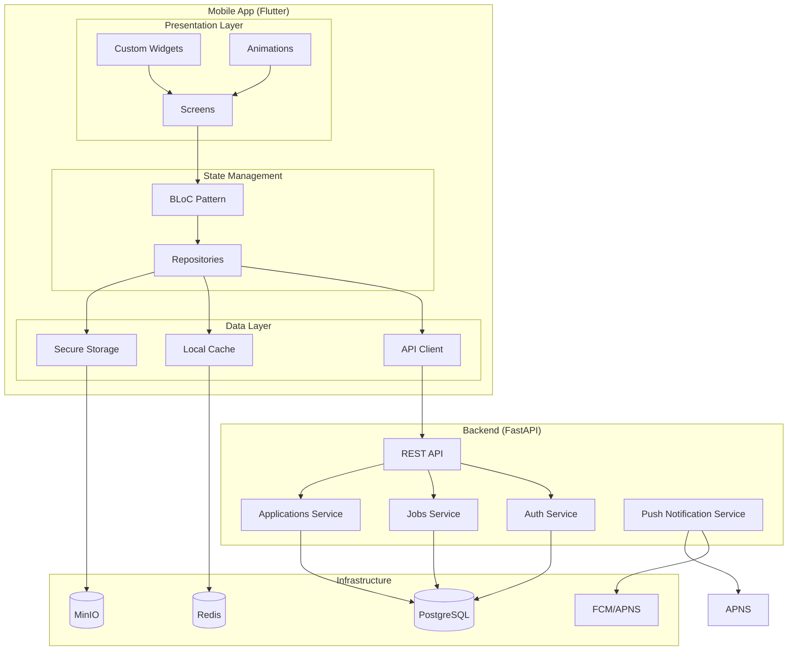

# JobSwipe Cross-Platform Implementation Plan

## Executive Summary

This plan outlines the complete implementation of a modern, cross-platform mobile application for JobSwipe using Flutter. The solution eliminates the need for XCode during development, provides a unique and brandable design system, and includes necessary backend improvements for mobile integration.

---

## Technology Stack Selection

### Mobile Framework: Flutter 3.24+

**Rationale**:
- Single codebase for iOS and Android
- No XCode required for development (only for final iOS build)
- Modern, trendy UI with Material Design 3 and Cupertino widgets
- Excellent performance (60fps native rendering)
- Hot reload for fast development
- Large ecosystem and community support
- Easy to create unique, brandable designs

### Backend: FastAPI (existing) + Mobile-Specific Improvements

### Design System: Custom Flutter Design System

---

## Architecture Overview



---

## Phase 1: Design System & UI/UX

### 1.1 Brand Identity

**Color Palette** - Vibrant, Modern, Unique

```dart
class AppColors {
  // Primary - Electric Purple Gradient
  static const primary = Color(0xFF6C5CE7);
  static const primaryDark = Color(0xFF4834D4);
  static const primaryLight = Color(0xFFA29BFE);
  
  // Secondary - Vibrant Coral
  static const secondary = Color(0xFFFD79A8);
  static const secondaryDark = Color(0xFFE84393);
  
  // Accent - Electric Blue
  static const accent = Color(0xFF0984E3);
  
  // Success - Mint Green
  static const success = Color(0xFF00B894);
  
  // Warning - Sunny Yellow
  static const warning = Color(0xFFFDCB6E);
  
  // Error - Coral Red
  static const error = Color(0xFFD63031);
  
  // Neutral - Modern Grays
  static const background = Color(0xFFF8F9FA);
  static const surface = Color(0xFFFFFFFF);
  static const textPrimary = Color(0xFF2D3436);
  static const textSecondary = Color(0xFF636E72);
}
```

**Typography** - Modern, Readable, Unique

```dart
class AppTypography {
  static const TextStyle displayLarge = TextStyle(
    fontSize: 57,
    fontWeight: FontWeight.w700,
    letterSpacing: -0.25,
  );
  
  static const TextStyle headline = TextStyle(
    fontSize: 32,
    fontWeight: FontWeight.w600,
  );
  
  static const TextStyle title = TextStyle(
    fontSize: 22,
    fontWeight: FontWeight.w600,
  );
  
  static const TextStyle body = TextStyle(
    fontSize: 16,
    fontWeight: FontWeight.w400,
  );
  
  static const TextStyle caption = TextStyle(
    fontSize: 14,
    fontWeight: FontWeight.w400,
  );
}
```

### 1.2 Design Tokens

```dart
class AppTokens {
  // Spacing
  static const double spacingXxs = 4.0;
  static const double spacingXs = 8.0;
  static const double spacingSm = 12.0;
  static const double spacingMd = 16.0;
  static const double spacingLg = 24.0;
  static const double spacingXl = 32.0;
  
  // Border Radius
  static const double radiusSm = 8.0;
  static const double radiusMd = 12.0;
  static const double radiusLg = 16.0;
  static const double radiusXl = 24.0;
  
  // Shadows
  static List<BoxShadow> shadowSm = [
    BoxShadow(
      color: Color(0x1A000000),
      blurRadius: 4,
      offset: Offset(0, 2),
    ),
  ];
  
  static List<BoxShadow> shadowMd = [
    BoxShadow(
      color: Color(0x33000000),
      blurRadius: 8,
      offset: Offset(0, 4),
    ),
  ];
}
```

### 1.3 Custom Components

**Swipeable Card Widget**
- Smooth swipe animations
- Haptic feedback
- Match score visualization
- Company logo with gradient background
- Quick action buttons

**Gradient Button**
- Animated gradient background
- Ripple effect
- Loading state
- Disabled state

**Glassmorphism Container**
- Blur effect
- Semi-transparent background
- Border with gradient
- Subtle shadow

**Animated Bottom Navigation**
- Floating design
- Active indicator with animation
- Badge notifications
- Smooth transitions

### 1.4 Animations & Micro-interactions

- **Page Transitions**: Shared element transitions
- **Swipe Gestures**: Physics-based animations
- **Button Presses**: Scale and ripple effects
- **Loading States**: Skeleton screens with shimmer
- **Success States**: Confetti or checkmark animations
- **Error States**: Shake animation with vibration

---

## Phase 2: Flutter App Architecture

### 2.1 Project Structure

```
lib/
├── main.dart
├── app.dart
├── config/
│   ├── app_config.dart
│   ├── api_config.dart
│   └── theme_config.dart
├── core/
│   ├── theme/
│   │   ├── app_colors.dart
│   │   ├── app_typography.dart
│   │   ├── app_tokens.dart
│   │   └── app_theme.dart
│   ├── widgets/
│   │   ├── common/
│   │   │   ├── app_button.dart
│   │   │   ├── app_card.dart
│   │   │   ├── app_text_field.dart
│   │   │   └── app_loading.dart
│   │   ├── job_card/
│   │   │   ├── swipeable_job_card.dart
│   │   │   └── job_card_content.dart
│   │   └── navigation/
│   │       └── animated_bottom_nav.dart
│   ├── utils/
│   │   ├── validators.dart
│   │   ├── extensions.dart
│   │   └── constants.dart
│   └── constants/
│       └── app_constants.dart
├── data/
│   ├── models/
│   │   ├── job.dart
│   │   ├── user.dart
│   │   ├── application.dart
│   │   └── auth_response.dart
│   ├── repositories/
│   │   ├── auth_repository.dart
│   │   ├── job_repository.dart
│   │   ├── application_repository.dart
│   │   └── profile_repository.dart
│   ├── datasources/
│   │   ├── remote/
│   │   │   ├── api_client.dart
│   │   │   └── api_endpoints.dart
│   │   └── local/
│   │       ├── cache_service.dart
│   │       └── secure_storage_service.dart
│   └── mappers/
│       └── response_mapper.dart
├── domain/
│   ├── entities/
│   │   ├── job_entity.dart
│   │   ├── user_entity.dart
│   │   └── application_entity.dart
│   ├── repositories/
│   │   ├── auth_repository.dart
│   │   ├── job_repository.dart
│   │   └── application_repository.dart
│   └── usecases/
│       ├── login_usecase.dart
│       ├── register_usecase.dart
│       ├── get_jobs_usecase.dart
│       └── apply_to_job_usecase.dart
├── presentation/
│   ├── bloc/
│   │   ├── auth/
│   │   │   ├── auth_bloc.dart
│   │   │   ├── auth_event.dart
│   │   │   └── auth_state.dart
│   │   ├── jobs/
│   │   │   ├── jobs_bloc.dart
│   │   │   ├── jobs_event.dart
│   │   │   └── jobs_state.dart
│   │   └── applications/
│   │       ├── applications_bloc.dart
│   │       ├── applications_event.dart
│   │       └── applications_state.dart
│   ├── screens/
│   │   ├── auth/
│   │   │   ├── login_screen.dart
│   │   │   ├── register_screen.dart
│   │   │   └── onboarding_screen.dart
│   │   ├── jobs/
│   │   │   ├── job_feed_screen.dart
│   │   │   └── job_detail_screen.dart
│   │   ├── applications/
│   │   │   └── applications_screen.dart
│   │   └── profile/
│   │       └── profile_screen.dart
│   └── routes/
│       └── app_router.dart
└── services/
    ├── notification_service.dart
    ├── analytics_service.dart
    └── biometric_service.dart
```

### 2.2 State Management: BLoC Pattern

**Why BLoC?**
- Clear separation of business logic from UI
- Testable and maintainable
- Reactive programming with Streams
- Excellent Flutter community support

**Example BLoC Structure**:

```dart
// jobs_bloc.dart
class JobsBloc extends Bloc<JobsEvent, JobsState> {
  final GetJobsUseCase getJobsUseCase;
  final SwipeJobUseCase swipeJobUseCase;
  
  JobsBloc({
    required this.getJobsUseCase,
    required this.swipeJobUseCase,
  }) : super(JobsInitial()) {
    on<LoadJobs>(_onLoadJobs);
    on<SwipeJob>(_onSwipeJob);
  }
  
  Future<void> _onLoadJobs(
    LoadJobs event,
    Emitter<JobsState> emit,
  ) async {
    emit(JobsLoading());
    final result = await getJobsUseCase();
    result.fold(
      (failure) => emit(JobsError(failure.message)),
      (jobs) => emit(JobsLoaded(jobs)),
    );
  }
}
```

### 2.3 Dependency Injection: GetIt

```dart
// service_locator.dart
final getIt = GetIt.instance;

void setupLocator() {
  // Services
  getIt.registerLazySingleton<ApiService>(() => ApiService());
  getIt.registerLazySingleton<CacheService>(() => CacheService());
  getIt.registerLazySingleton<SecureStorageService>(
    () => SecureStorageService(),
  );
  
  // Repositories
  getIt.registerLazySingleton<AuthRepository>(
    () => AuthRepositoryImpl(
      apiService: getIt(),
      secureStorage: getIt(),
    ),
  );
  
  // Use Cases
  getIt.registerFactory<LoginUseCase>(
    () => LoginUseCase(authRepository: getIt()),
  );
  
  // BLoCs
  getIt.registerFactory<AuthBloc>(
    () => AuthBloc(
      loginUseCase: getIt(),
      registerUseCase: getIt(),
    ),
  );
}
```

---

## Phase 3: Backend Improvements for Mobile

### 3.1 Mobile-Specific Endpoints

**New Endpoints**:

```python
# backend/api/routers/mobile.py

@router.get("/v1/mobile/feed", response_model=MobileJobFeedResponse)
async def get_mobile_job_feed(
    cursor: Optional[str] = None,
    limit: int = 20,
    current_user: User = Depends(get_current_user),
):
    """Optimized job feed for mobile with cursor pagination"""
    pass

@router.get("/v1/mobile/jobs/{job_id}", response_model=MobileJobDetailResponse)
async def get_mobile_job_detail(
    job_id: UUID,
    current_user: User = Depends(get_current_user),
):
    """Mobile-optimized job details"""
    pass

@router.post("/v1/mobile/device/register")
async def register_mobile_device(
    device: DeviceRegistration,
    current_user: User = Depends(get_current_user),
):
    """Register mobile device for push notifications"""
    pass
```

### 3.2 Push Notification Service

**Implementation**:

```python
# backend/services/notification_service.py

class NotificationService:
    def __init__(self):
        self.fcm = FirebaseMessaging()
        self.apns = APNsClient()
    
    async def send_push_notification(
        self,
        user_id: UUID,
        title: str,
        body: str,
        data: dict = None,
    ):
        """Send push notification to user's devices"""
        devices = await self.get_user_devices(user_id)
        
        for device in devices:
            if device.platform == "ios":
                await self.apns.send(
                    device.token,
                    title,
                    body,
                    data,
                )
            elif device.platform == "android":
                await self.fcm.send(
                    device.token,
                    title,
                    body,
                    data,
                )
```

### 3.3 Response Compression

```python
# backend/api/main.py

app.add_middleware(
    GZipMiddleware,
    minimum_size=1000,
)
```

### 3.4 Mobile-Optimized Response Models

```python
# backend/api/models/mobile.py

class MobileJobCard(BaseModel):
    id: UUID
    title: str
    company: str
    logo_url: Optional[str]
    match_score: float
    salary_range: Optional[str]
    location: str
    
    class Config:
        # Exclude heavy fields for mobile
        fields = {
            'id', 'title', 'company', 'logo_url',
            'match_score', 'salary_range', 'location'
        }
```

---

## Phase 4: Implementation Roadmap

### Sprint 1: Foundation (Week 1-2)
- [ ] Set up Flutter project
- [ ] Configure BLoC and GetIt
- [ ] Implement design system (colors, typography, tokens)
- [ ] Create base widgets (button, card, text field)
- [ ] Set up API client
- [ ] Implement secure storage

### Sprint 2: Authentication (Week 3)
- [ ] Create auth BLoC
- [ ] Build login screen with animations
- [ ] Build register screen with validation
- [ ] Implement onboarding flow
- [ ] Add biometric authentication
- [ ] Connect to backend auth endpoints

### Sprint 3: Job Feed (Week 4-5)
- [ ] Create jobs BLoC
- [ ] Build swipeable job card widget
- [ ] Implement job feed screen
- [ ] Add infinite scroll pagination
- [ ] Implement swipe gestures with physics
- [ ] Add haptic feedback
- [ ] Connect to backend jobs endpoints

### Sprint 4: Applications (Week 6)
- [ ] Create applications BLoC
- [ ] Build applications list screen
- [ ] Implement application status tracking
- [ ] Add application detail view
- [ ] Implement cancel application
- [ ] Add audit log viewer

### Sprint 5: Profile (Week 7)
- [ ] Create profile BLoC
- [ ] Build profile screen
- [ ] Implement profile editing
- [ ] Add resume upload with parsing
- [ ] Implement skills management
- [ ] Add experience/education sections

### Sprint 6: Backend Mobile Features (Week 8)
- [ ] Add mobile-specific endpoints
- [ ] Implement push notification service
- [ ] Add device registration
- [ ] Implement response compression
- [ ] Add mobile-optimized response models
- [ ] Update API documentation

### Sprint 7: Polish & Testing (Week 9-10)
- [ ] Add dark mode support
- [ ] Implement accessibility features
- [ ] Add error handling and retry logic
- [ ] Implement offline support
- [ ] Add analytics tracking
- [ ] Write unit tests
- [ ] Write integration tests
- [ ] Performance optimization

### Sprint 8: Deployment (Week 11-12)
- [ ] Configure iOS build (CI/CD)
- [ ] Configure Android build (CI/CD)
- [ ] Set up app store deployment
- [ ] Set up Play Store deployment
- [ ] Configure crash reporting
- [ ] Set up monitoring

---

## Phase 5: Key Features

### 5.1 Swipe Interface
- Physics-based card swiping
- Haptic feedback on swipe
- Undo last swipe
- Super like feature
- Pass with reason

### 5.2 Match Visualization
- Match score with animated progress ring
- Skill match breakdown
- Location match indicator
- Salary match indicator

### 5.3 Application Tracking
- Real-time status updates
- Push notifications for status changes
- Application timeline
- Audit log viewer

### 5.4 Profile Management
- Resume upload with AI parsing
- Skills tagging
- Experience timeline
- Education history
- Portfolio links

### 5.5 Push Notifications
- New job matches
- Application status updates
- Interview reminders
- Weekly digest

---

## Phase 6: Testing Strategy

### 6.1 Unit Tests
- BLoC tests
- Repository tests
- Use case tests
- Widget tests

### 6.2 Integration Tests
- API integration tests
- End-to-end user flows
- Authentication flows
- Payment flows (if any)

### 6.3 Widget Tests
- Widget rendering tests
- Gesture tests
- Animation tests

### 6.4 Performance Tests
- Frame rate monitoring
- Memory usage profiling
- Network request optimization
- Image loading optimization

---

## Phase 7: Deployment Strategy

### 7.1 CI/CD Pipeline

**GitHub Actions**:
```yaml
name: Build and Deploy

on:
  push:
    branches: [main]

jobs:
  build-android:
    runs-on: ubuntu-latest
    steps:
      - uses: actions/checkout@v3
      - uses: subosito/flutter-action@v2
      - run: flutter build apk --release
      - uses: actions/upload-artifact@v3
        with:
          name: release-apk
          path: build/app/outputs/flutter-apk
  
  build-ios:
    runs-on: macos-latest
    steps:
      - uses: actions/checkout@v3
      - uses: subosito/flutter-action@v2
      - run: flutter build ios --release
      - uses: actions/upload-artifact@v3
        with:
          name: release-ios
          path: build/ios/ipa
```

### 7.2 App Store Deployment
- TestFlight for beta testing
- App Store Connect for production
- Automated screenshots generation
- App store optimization (ASO)

### 7.3 Play Store Deployment
- Internal testing track
- Alpha testing track
- Beta testing track
- Production track

---

## Phase 8: Monitoring & Analytics

### 8.1 Crash Reporting
- Firebase Crashlytics
- Sentry integration
- Error tracking
- Stack trace collection

### 8.2 Analytics
- Firebase Analytics
- User behavior tracking
- Feature usage metrics
- Conversion tracking

### 8.3 Performance Monitoring
- Firebase Performance Monitoring
- Frame rate tracking
- Network latency
- App startup time

---

## Success Criteria

1. **Cross-Platform**: Single codebase deploys to both iOS and Android
2. **No XCode Required**: Development possible without XCode
3. **Modern Design**: Unique, brandable UI with animations
4. **Performance**: 60fps animations, <3s app startup
5. **Offline Support**: Core features work offline
6. **Push Notifications**: Real-time updates for users
7. **Test Coverage**: >80% unit test coverage
8. **User Satisfaction**: >4.5 star rating on both stores

---

## Risks & Mitigations

| Risk | Impact | Mitigation |
|-------|---------|------------|
| Flutter learning curve | Medium | Use experienced Flutter developers, provide training |
| iOS build requires Mac | High | Use CI/CD with Mac runners, cloud build services |
| Push notification complexity | Medium | Use Firebase for both platforms |
| Performance issues | High | Profile early, optimize images, use lazy loading |
| Design consistency | Medium | Strict design system, component library |

---

## Next Steps

1. **Approve this plan** - Review and approve architecture and implementation approach
2. **Set up Flutter project** - Initialize project with required dependencies
3. **Implement design system** - Create colors, typography, tokens, and base widgets
4. **Build authentication flow** - Login, register, onboarding
5. **Build job feed** - Swipeable cards with animations
6. **Implement backend improvements** - Mobile endpoints, push notifications
7. **Test and deploy** - Comprehensive testing and deployment to stores
